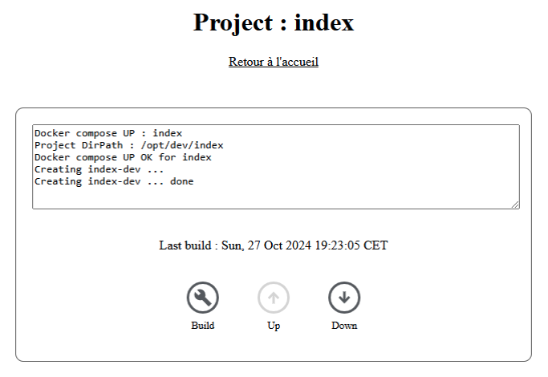

# go-builder

Go-builder is basically a web server image for building GoLang applications. You can build programs with or without cgo, and control the execution of the built image (when a Dockefile is present) with a docker compose file directly from the interface.

